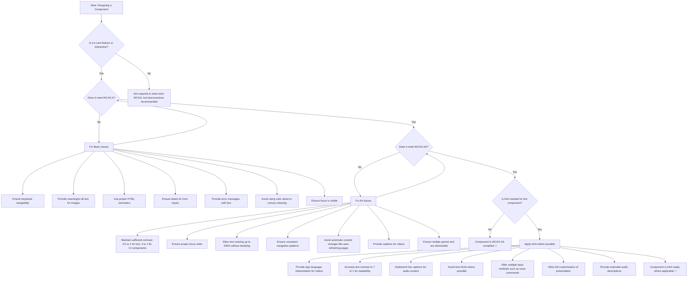

# A11y Jam Sessions - FAQs and Resources

Our casual, friendly online jam to learn about accessibility in Design Systems

## Community & Support

Join our Slack community to ask questions, share resources, and connect with other designers and developers interested in accessibility.

- [Join Into Design Systems (IDS) Slack](https://intodesignsystems.slack.com/) 
- [Engage in our #accessibility channel](https://intodesignsystems.slack.com/archives/C02T1SUCVEZ)

### Accessibility Hosts and Advocates

#### Sarah Massengale
- CPACC, ADS certified, blind, digital accessibility trainer 
- [LinkedIn Profile](https://www.linkedin.com/in/sarah-massengale-408069165/)
- [Book a consulting session](http://www.sma11y.com/)

#### Marcelo Paiva
- Creator of WCAG plugin for Figma
- [LinkedIn Profile](https://www.linkedin.com/in/mtpaiva/)
- [Schedule a 1:1 meeting](https://mpaiva.youcanbook.me/)

---

## Accessibility Standards & WCAG

### 1. What is WCAG, and why is it important for UX designers?

WCAG (Web Content Accessibility Guidelines) is an internationally recognized set of guidelines that ensure web content is accessible to people with disabilities. UX designers should follow WCAG to create inclusive experiences that accommodate users with visual, auditory, cognitive, and motor impairments.

### 2. What is the difference between WCAG levels A, AA, and AAA?

**Level A**
- Basic accessibility requirements that all websites should meet
- Fundamental access requirements
- Minimum level of compliance

**Level AA**
- Recommended standard for most organizations
- Covers broader range of disabilities
- Balance of achievable and impactful requirements

**Level AAA**
- Highest level of accessibility
- Ideal for highly inclusive experiences
- Most comprehensive but challenging to achieve

### 3. Are there other accessibility standards besides WCAG that UX designers should know about?

Yes, in addition to WCAG, UX designers should be aware of:

- Section 508 (U.S. government accessibility standard)
- EN 301 549 (European standard for digital accessibility)
- ADA (Americans with Disabilities Act) (U.S. law requiring digital accessibility)
- COGA (Cognitive and Learning Disabilities Accessibility Task Force) (focused on cognitive accessibility)

### 4. How does accessibility apply beyond WCAG conformance?

WCAG focuses on technical guidelines, but true accessibility involves usability for diverse audiences. This includes:

- Designing for cognitive disabilities (e.g., dyslexia, ADHD)
- Simplifying language and reducing jargon
- Offering multiple ways to complete tasks (e.g., voice input, keyboard navigation)

### 5. Should we follow APCA instead of WCAG contrast guidelines?

APCA offers a more dynamic and perceptually accurate approach to color contrast, but WCAG is still the official compliance standard. Designers can reference APCA for improved readability while ensuring their designs meet WCAG contrast requirements.

## Component Design & Implementation

### 6. What are the most common accessibility mistakes in UX design?

- Using low-contrast text that is hard to read.
- Relying only on color to convey meaning.
- Not providing alternative text for images.
- Poor keyboard navigation and missing focus indicators.
- Using non-standard components that don't work with assistive technologies.
- Overcomplicated interactions that increase cognitive load.

### 7. How can we make interactive components more accessible?

- Ensure buttons and links have clear, descriptive labels.
- Provide sufficient contrast for text and interactive elements.
- Implement keyboard navigation and focus management.
- Use ARIA (Accessible Rich Internet Applications) attributes where necessary, but not as a substitute for semantic HTML.
- Test with real users, including those who rely on screen readers and keyboard navigation.

### 8. How do I ensure that my design system components remain accessible?

- Build accessibility checks into your design review process.
- Use automated testing tools alongside manual testing.
- Maintain clear documentation on accessibility requirements for each component.
- Encourage cross-functional collaboration between UX, developers, and accessibility experts.

### 9. What's the best approach for handling accessibility in UI animations?

- Allow users to disable animations if they have motion sensitivity.
- Avoid flashing or rapid movement to prevent seizures (WCAG 2.3.1).
- Ensure animations do not block essential content or interactions.

### 10. What should be considered when designing forms for accessibility?

- Label all form fields clearly and associate labels properly using <label for> attributes.
- Use placeholder text only as a supplement, not a replacement for labels.
- Provide error messages with clear instructions on how to fix input mistakes.
- Ensure form elements are keyboard accessible and have a visible focus state.

### 11. What are common accessibility pitfalls in mobile UX design?

- Small touch targets that make it difficult for users with motor disabilities to tap.
- Poor color contrast in dark mode designs.
- Overuse of gestures without alternatives like buttons.
- Lack of screen reader-friendly content hierarchy.

### 12. How can I balance accessibility with brand aesthetics?

- Use high-contrast colors while maintaining brand consistency.
- Offer users personalization options (e.g., font size, dark/light mode).
- Prioritize clarity and usability over decorative elements.

## Testing & Tools

### 13. How do we test for cognitive accessibility beyond WCAG guidelines?

- Use plain language and avoid unnecessary jargon.
- Reduce cognitive load by using progressive disclosure.
- Offer multiple ways to complete tasks (e.g., text, voice, touch).
- Test designs with users who have cognitive disabilities.

### 14. What tools can UX designers use to check for accessibility issues?

- Automated tools: axe DevTools, WAVE, Lighthouse, WebAIM Contrast Checker.
- Screen readers: NVDA (Windows), VoiceOver (Mac/iOS), JAWS.
- Keyboard testing: Navigate interfaces using only the Tab and arrow keys to check for focus management.

### 15. How often should accessibility audits be conducted?

Regular accessibility audits should be part of the design and development cycle:

- Before development: Include accessibility in wireframes and prototypes.
- During development: Conduct iterative testing with automated tools.
- Before launch: Perform manual accessibility audits and usability tests with disabled users.
- Ongoing: Regularly review components and content updates to maintain compliance.

### 16. What is the best way to document accessibility for development teams?

- Provide a checklist of WCAG requirements for each component.
- Include accessibility annotations in Figma or design specs.
- Offer code snippets and implementation guidance for developers.
- Conduct training sessions to align teams on best practices.

## Organizational Implementation

### 17. How can we get leadership buy-in for prioritizing accessibility?

- Highlight the legal risks of non-compliance (ADA lawsuits, fines).
- Show the business case: Accessible websites improve usability for all users, increasing customer engagement.
- Use real-world examples and data to demonstrate impact (e.g., companies that increased conversions through accessibility improvements).

### 18. How do we integrate accessibility into the design process?

- Include accessibility considerations in user research.
- Build accessible components into the design system.
- Test designs with assistive technology users early in the process.
- Collaborate with developers to ensure proper implementation.

### 19. How do we create an inclusive user research process?

- Recruit participants with diverse disabilities.
- Offer remote usability testing options.
- Ensure research materials are accessible (e.g., captioned videos, readable surveys).

### 20. How can we advocate for accessibility in organizations?

- Start with small, high-impact changes (e.g., fixing contrast issues, adding alt text).
- Educate stakeholders about the benefits of accessibility beyond compliance.
- Gather feedback from users with disabilities and share their experiences.
- Leverage industry case studies to show how accessibility drives business growth.

## AI & Accessibility

### 21. How can AI-generated content be made more accessible?

- Ensure AI-generated text follows plain language principles (short sentences, clear structure, minimal jargon).
- Provide alternative formats (e.g., AI-generated descriptions should be available as text, audio, and visual representations).
- Ensure content can be easily read by screen readers by avoiding special characters, excessive emojis, and ASCII art.

### 22. How can AI-generated images be more inclusive?

- Specify diverse representations in prompts (e.g., "a diverse group of people, including individuals using wheelchairs and sign language").
- Avoid stereotypes and ableist depictions (e.g., don't depict disability as an object of pity or inspiration).
- Ensure AI-generated images have alt text and descriptive captions for users who rely on screen readers.

### 23. How can AI chatbots be more inclusive for cognitive disabilities?

- Allow multiple input methods (voice commands, typed input, and simplified choices).
- Reduce cognitive overload by summarizing responses and providing clear action steps.
- Offer adaptive interactions, such as confirming complex tasks before proceeding (e.g., "Would you like me to repeat that in a simpler way?").

### 24. How do I write AI prompts that prioritize accessibility?

- If requesting AI-generated UI suggestions, include "keyboard navigable" and "voice-command compatible" in the prompt.
- For AI-generated content summaries, request "concise, structured, and screen-reader friendly formats."
- When designing AI for voice interfaces, specify "clear, slow speech output with optional speed adjustments."

### 25. What are best practices for AI-generated captions and transcripts?

- Ensure captions are synchronized with speech and include non-verbal cues (e.g., "[laughter]" or "[music playing]").
- Use human-edited captions for accuracy in professional content.
- For transcripts, structure them clearly, including speaker labels and timestamping.

### 26. How can AI assist in creating accessible UX content?

- Use AI to generate accessible alt text based on image context.
- Generate multiple readability levels for content, ensuring accessibility for users with different literacy levels.
- Suggest inclusive language alternatives to avoid ableist terms (e.g., recommending 'person with low vision' instead of 'visually impaired' to emphasize person-first language where appropriate).

## Quick Reference Section

### Common Myths About Accessibility

#### Myth 1: "Accessibility is only for blind users"
→ False! It benefits users with diverse disabilities, including mobility, cognitive, and auditory impairments

#### Myth 2: "ARIA fixes everything"
→ False! ARIA should be used only when semantic HTML doesn't provide the necessary accessibility

#### Myth 3: "Accessibility is too expensive"
→ False! Implementing accessibility from the start saves money by reducing costly retrofitting later

## Appendix

### Accessible Component Design Decision Tree

#### How to Use This Decision Tree:

This decision tree helps you check if your component meets accessibility standards. Follow these steps in order:

1. Start with WCAG A
   - Make sure everyone can use your component
   - Check keyboard access, labels, focus visibility, and alt text for images

2. Move to WCAG AA if A is complete
   - Improve contrast so text is easy to read
   - Make sure users can resize text without breaking the layout
   - Add captions for videos and check focus order

3. Check if AAA is needed
   - Some projects, like government or inclusive products, may need extra features
   - AAA includes sign language for videos, high contrast text, and more customization options

Your component is ready when all required levels are met.

## Tools & Resources for UX Designers

### Design Tools & Plugins

#### Figma Plugins
- [A11y - Color Contrast Checker](https://www.figma.com/community/plugin/733159460536249875/A11y---Color-Contrast-Checker)
- [Stark](https://www.figma.com/community/plugin/732603254453395948/Stark)
- [Able – Friction free accessibility](https://www.figma.com/community/plugin/734693888346260052/Able-%E2%80%93-Friction-free-accessibility)
- [Content Reel - Accessibility Edition](https://www.figma.com/community/plugin/731627216655469013/Content-Reel)
- [WCAG Plugin](https://www.figma.com/community/plugin/1373362852131056921/wcag-plugin)
- [WCAG 2.2 Card Deck](https://www.figma.com/community/file/1409436654182046971/wcag-2-2-card-deck)

#### Color Tools
- [Contrast](https://usecontrast.com/) - macOS app for WCAG color compliance
- [Leonardo](https://leonardocolor.io/) - Generate accessible color palettes
- [Who Can Use](https://www.whocanuse.com/) - Color contrast checker with simulated vision types

### Learning Resources

#### Courses & Certification
- [Web Accessibility by Google (Udacity)](https://www.udacity.com/course/web-accessibility--ud891) - Free course
- [IAAP Certification](https://www.accessibilityassociation.org/certification) - Industry-recognized accessibility certifications
- [Deque University](https://dequeuniversity.com/) - Comprehensive accessibility training

#### Style Guides & Documentation
- [Microsoft Inclusive Design](https://www.microsoft.com/design/inclusive/)
- [Apple Accessibility Guidelines](https://developer.apple.com/design/human-interface-guidelines/accessibility)
- [Material Design Accessibility](https://material.io/design/usability/accessibility.html)

#### Articles & Newsletters
- [A11y Weekly](https://a11yweekly.com/) - Weekly accessibility newsletter
- [Accessibility Guidelines Posters](https://github.com/UKHomeOffice/posters/) - Home Office Digital
- [Smashing Magazine's Accessibility Guide](https://www.smashingmagazine.com/guides/accessibility/)

### Testing Tools

#### Automated Testing
- [axe DevTools](https://www.deque.com/axe/devtools/) - Browser extension for accessibility testing
- [WAVE](https://wave.webaim.org/) - Web accessibility evaluation tool
- [Lighthouse](https://developers.google.com/web/tools/lighthouse) - Automated auditing tool

#### Screen Readers
- [VoiceOver](https://www.apple.com/accessibility/vision/) - Built into macOS and iOS
- [NVDA](https://www.nvaccess.org/) - Free screen reader for Windows
- [ChromeVox](https://chrome.google.com/webstore/detail/screen-reader/kgejglhpjiefppelpmljglcjbhoiplfn) - Chrome extension screen reader

