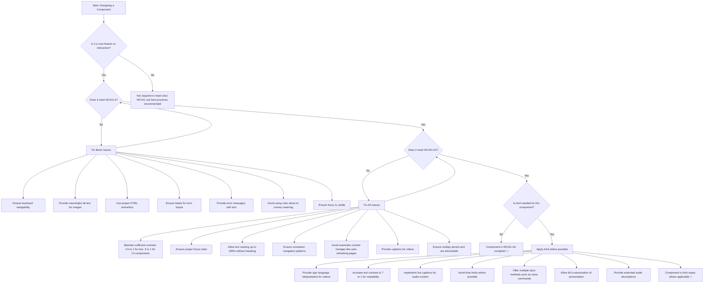

# a11y-jam-sessions
Our casual, friendly online jam to learn about accessibility in Design Systems

# Appendix

## Accessible Component Design Decision Tree

### How to Use This Decision Tree:

This decision tree helps you check if your component meets accessibility standards. Follow these steps in order:
	
1.	Start with WCAG A
	•	Make sure everyone can use your component.
	•	Check keyboard access, labels, focus visibility, and alt text for images.
2.	Move to WCAG AA if A is complete
	•	Improve contrast so text is easy to read.
	•	Make sure users can resize text without breaking the layout.
	•	Add captions for videos and check focus order.
3.	Check if AAA is needed
	•	Some projects, like government or inclusive products, may need extra features.
	•	AAA includes sign language for videos, high contrast text, and more customization options.

Your component is ready when all required levels are met.

